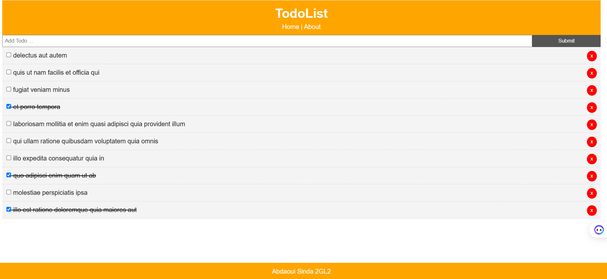

# TodoList

This is the code for the React crash course on YouTube

## Quick Start

```bash
# Install dependencies
npm install

# Serve on localhost:3000
npm start

# Build for production
npm run build
```


